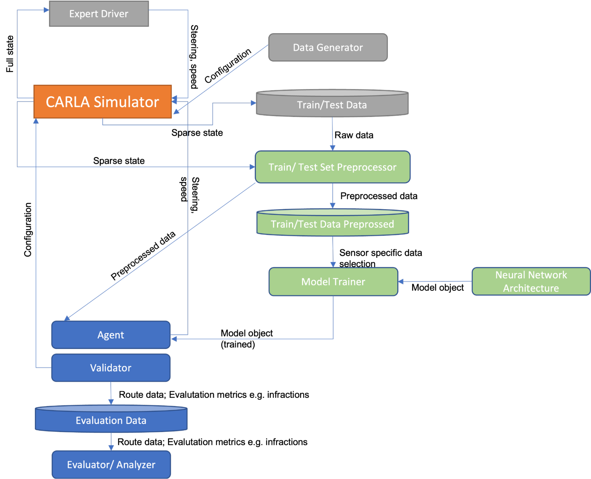

# End2Endappras
For further explanation of workflow and reasoning behind this project, please read the following document: 

[System-Design-Specifications](Final SDS - Hand in this one.docx.pdf)

[Presentation](Final presentation APPRAS V2.pptx.pdf)

## Description

This repository was created for the course Applications of Robotics and Autonomous Systems at TU Berlin WS22/23. 
The project aims to create a End-to-End model for autonomous driving that is developed in the simulator Carla. 
Specifically, the project aims to investigate and compare the performance of several different sensor-setups. 
Due to the challenging nature of the project, only two sensor-setups and models for End-to-End autonomous driving were created and compared: RGB and RGB + LiDAR. 

## System Architecture
In the following system architecture diagram the data engineering related components are highlighted in gray, the data science related components in green and the evaluation related components in blue.

## Usage

### Scenario 1: Model Training
1. Download the dataset generated by Transfuser by running the `data_generation/download_data.sh` script. Move the resulting directory into the `data` directory.
2. Follow the `data_generation/README.md` file to generate additional noise injected data. This step is optional but recommended!
3. Run the `data_pipeline/notebooks/data_cleansing.ipynb` notebook to perform data cleansing on the available data.
4. If Lidar should be used in training, run the `data_pipeline/notebooks/lidar_to_disk.ipynb` notebook to transform the raw lidar data to birds-eye-view and safe them to disk for further useage.
6. Adjust the default setting in the "Choose settings" section at the top of the `models/notebooks/run_model_trainer.ipynb` notebook optionally, and run the remaining part of the notebook afterwards.
7. Observe your model and performance statistics in the `models/notebooks/experiment_files` folder in the subfolder with the most recent timestamp.

### Scenario 2: Model Evaluation in the Leaderboard
See `Evaluation/README.md`.

## Authors and acknowledgment
Team Members:  Jakob Wiren, Julian Klitzing,  Moritz Wassmer, Ege Atesalp.
Special thanks to all the guidance and support provided by the DAI-Laboratory of the Technical University of Berlin - especially to our supervisor Philipp Grosenick.

## Project status
Finished, with recommendations for further work specified. 

***
