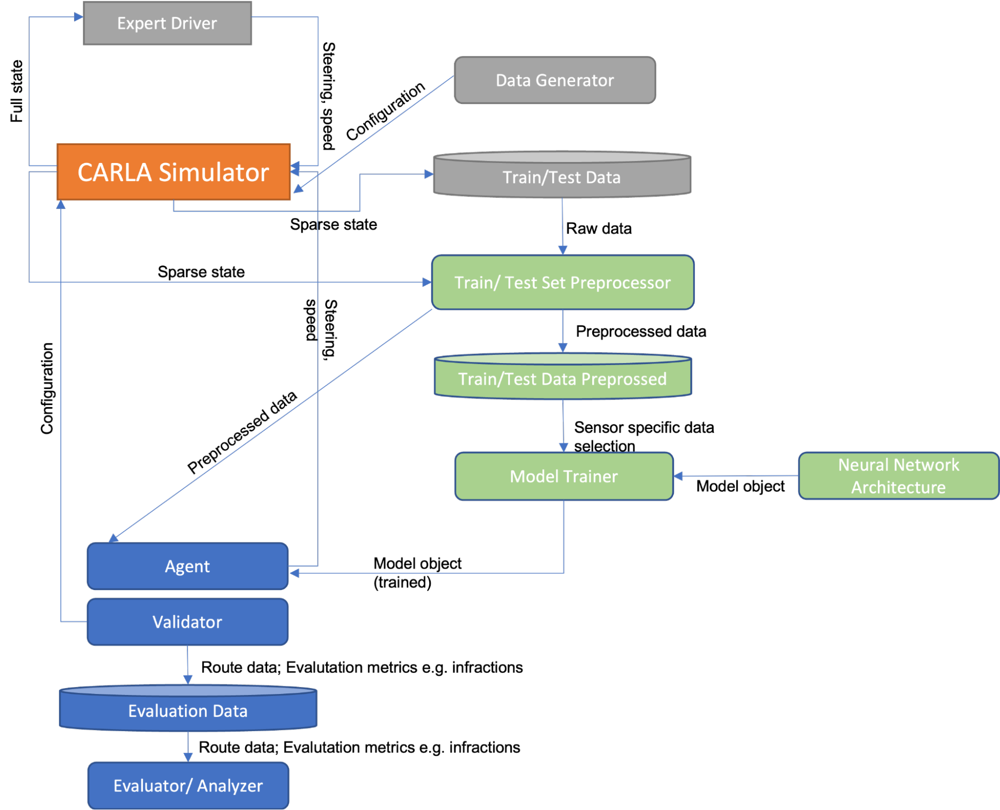

# End2Endappras
[System-Design-Specifications](Final SDS - Hand in this one.docx.pdf)

[Presentation](Final presentation APPRAS V2.pptx.pdf)

## Description

This repository was created for the course Applications of Robotics and Autonomous Systems at TU Berlin WS22/23. 
The project aims to create a End-to-End model for autonomous driving that is developed in the simulator Carla. 
Specifically, the project aims to investigate and compare the performance of several different sensor-setups. 
Due to the challenging nature of the project, only two sensor-setups and models for End-to-End autonomous driving were created and compared: RGB and RGB + LiDAR. 

## System Architecture
In the following system architecture diagram the data engineering related components are highlighted in gray, the data science related components in green and the evaluation related components in blue.

## System specifications

**CARLA Simulator**

Used for data generation and interaction of our trained agent with the environment. For this experiment we have used CARLA 0.9.10.1. 

**Expert Driver**

The expert driver is a hardcoded agent that can perform “perfect” driving in the CARLA simulator and is thus used for generation of the train and test data sets. It is a rule-based expert algorithm used and Its performance is an upper bound for the learning-based agent. The autopilot has access to the complete state of the environment including vehicle and pedestrian locations and actions. 

**Data Generator**

Used to initialize the CARLA simulator environment (i.e. driving conditions such as other vehicles, pedestrians, …) and to instantiate the expert driver. It then runs the simulation and saves the data. We have used noise injected data in our 
training to improve our agents.

**Train/Test Data**

This data is the foundation for model training and evaluation. The database stores the sparse state emitted by the CARLA Simulator. The sparse state consists of all defined sensor data, vehicle control signals and vehicle state measurements. 

**Train/Test Set Preprocessor**

Used to perform preprocessing tasks on the data stored in the Train/Test Data database to prepare them for neural network usage.

**Train/Test Data Preprocessed**

Is a database that stores the preprocessed data to make preprocessed data reusable.

**Neural Network Architecture**

Defines the neural network architecture that will be trained.

**Model Trainer**

Trains the given model architecture according to defined schedules, hyperparameters etc.

**Agent**

Is the end-to-end network that represents the learned driving policy and interacts with the CARLA simulator.

**Validator**

Similarly to the Data Generator, it initializes a simulator environment and initiates the Agent built upon the trained model. Then it runs the simulation and captures the driving performance of the autonomous agent for all tracks which are to be tested.

**Evaluation Data**

Contains the performance measures of the autonomous agents for every tested track.

**Evaluator/ Analyzer**

Visualizes and analyzes the evaluation data regarding overall performance of the autonomous agents. From that we are going to extract our results for the experiments i.e. comparing the driving performance between the different sensor setups.

## Usage

### Scenario 1: Model Training
1. Download the dataset generated by Transfuser by running the data_generation/download_data.sh script.
2. Follow the readme file in the TODO: "data_generation" folder to generate additional noise injected data. This step is optional but recommended!
3. Run the data_pipeline/notebooks/data_cleansing notebook to perform data cleansing on the available data.
4. If Lidar should be used in training, run the data_pipeline/notebooks/lidar_to_disk notebook to transform the raw lidar data to birds-eye-view and safe them to disk for further useage.
6. Adjust the default setting in the "Choose settings" section at the top of the models/notebooks/run_model_trainer notebook optionally, and run the remaining part of the notebook afterwards.
7. Observe your model and performance statistics in the models/notebooks/experiment_files folder in the subfolder with the most recent timestamp.

### Scenario 2: Model Evaluation in the Leaderboard
TODO -->@moritz28

## Authors and acknowledgment
Team Members:  Jakob Wiren, Julian Klitzing,  Moritz Wassmer, Ege Atesalp, Can Kayser.
Special thanks to all the guidance and support provided by the DAI-Laboratory of the Technical University of Berlin - especially to our supervisor Philipp Grosenick.

## Project status
Finished, with recommendations for further work specified. 

***
