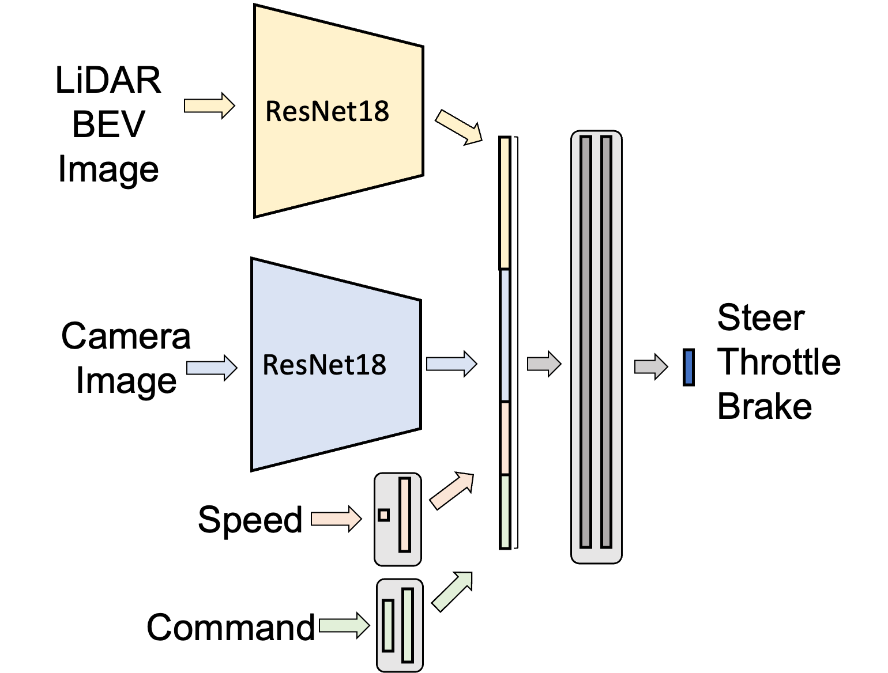
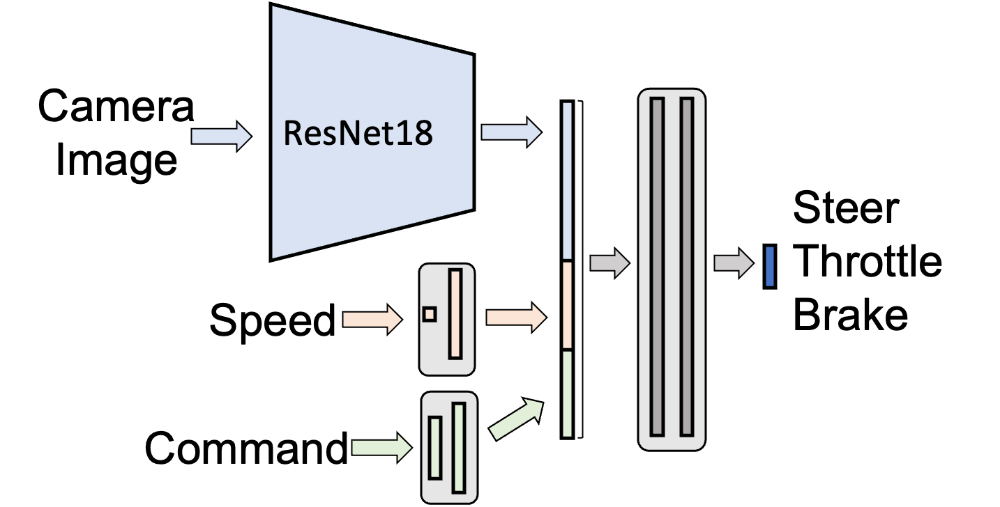

# Models

## model_trainer.py
Modularized trainings pipeline for consistency.

## resnet_lidar
Provides architectures and weights for the lidar model. The final selected model architecture is defined im `lidar_v1.py` with class `name Resnet_Lidar_V1_Dropout`. It is illustrated below.
<!--  -->

  

## resnet_rgb
Provides architectures and weights for the rgb model. Also contains development notebooks for experimentation without messing around with the model_trainer which is meant to be a stable version. The final selected model architecture is defined im `architectures_v3.py` with class name `Resnet_Baseline_V3_Dropout`. It is illustrated below.

  

### Architectures
All architecture are inspired by the following Papers:
- End-to-end Driving via Conditional Imitation Learning https://arxiv.org/abs/1710.02410
- Exploring the Limitations of Behavior Cloning for Autonomous Driving Exploring the Limitations of Behavior Cloning for Autonomous Driving  https://arxiv.org/abs/1904.08980
- Multimodal E2E AD https://arxiv.org/abs/1906.03199
